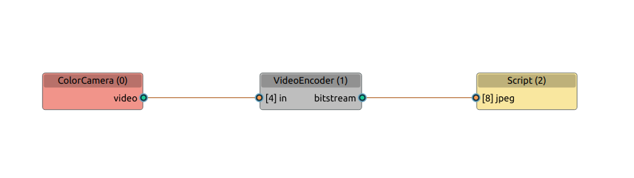

## POE 设备 独立模式

> 独立模式意味着 OAK 摄像头没有连接到主机计算机。这可以通过首先 Flash 引导加载程序，
> 然后将管道和资产 (NN 模型) Flash 到 OAK 的闪存来实现。

由于主机和设备之间不会有任何通信，因此首先需要删除所有 `XLinkOut` 和 `XLinkIn` 节点。
这意味着设备只能通过 `Script` 节点（网络协议：HTTP/TCP/UDP）与 “外部世界” 通信。

### Flash 引导加载程序

Bootloader 与 depthai 打包在一起，因此如果您有最新的 depthai 版本，您可以闪存最新的 Bootloader 版本。
要 Flash 引导加载程序，使用 `poe_standalone flash_bootloader` 。
要查看其背后的 API 代码，请参见 
[FlashBootloader](https://docs.luxonis.com/projects/api/en/latest/samples/bootloader/flash_bootloader/#flash-bootloader)
示例代码。

### Flash 管道

已经在设备上 
[Flash 引导加载程序](#flash-%E5%BC%95%E5%AF%BC%E5%8A%A0%E8%BD%BD%E7%A8%8B%E5%BA%8F)
之后，可以将管道连同它的资产 (NN 模型) 一起 Flash 到 OAK 的闪存:
`poe_standalone flash_pipeline` 或

```python
import depthai as dai

pipeline = dai.Pipeline()

# Define standalone pipeline; add nodes and link them
# cam = pipeline.create(dai.node.ColorCamera)
# script = pipeline.create(dai.node.Script)
# ...

# Flash the pipeline
(f, bl) = dai.DeviceBootloader.getFirstAvailableDevice()
bootloader = dai.DeviceBootloader(bl)
progress = lambda p: print(f'\rFlashing progress: {p:.2%}')
bootloader.flash(progress, pipeline)
```

成功 Flash 管道后，当您启动设备时，它将自动启动。如果要更改管道，只需再次重新 Flash。

#### 管道可视化

> 参考 [DepthAI Pipeline Graph](https://github.com/geaxgx/depthai_pipeline_graph)

- simple_pipeline 
  
- yolo_stereo_decoding
  

## 代码示例

github 仓库：[OAK-POE Standalone](https://github.com/richard-xx/oak-poe-standalone)

### 安装（可选）

```shell
pip install -e .
```
或者
```shell
pip install .
```

### 使用帮助

`python poe_standalone/standalone.py -h` 或 `poe_standalone -h` 

```shell

 Usage: standalone.py [OPTIONS] COMMAND [ARGS]...                               
                                                                                
 OAK POE STANDALONE SCRIPTS                                                     
                                                                                
╭─ Options ────────────────────────────────────────────────────────────────────╮
│ --device_ip        -device_ip  IP ADDRESS             The IP of the OAK      │
│                                                       device you want to     │
│                                                       connect to. The        │
│                                                       default is to list all │
│                                                       for you to choose      │
│                                                       from.                  │
│ --host_ip          -host_ip    IP ADDRESS             The IP of the Host pc  │
│                                                       you want to connect    │
│                                                       to.                    │
│                                                       [default: 192.168.0.1] │
│ --pipeline         -P          [script_http_server|s  Pipeline you want to   │
│                                cript_mjpeg_server|tc  start.                 │
│                                p_streaming_server|tc  [default:              │
│                                p_streaming_server_co  script_http_server]    │
│                                nfig_focus|tcp_stream                         │
│                                ing_client|yolo_decod                         │
│                                ing|yolo_stereo_decod                         │
│                                ing|custom_pipeline]                          │
│ --custom_pipeline  -cp         FILE PATH              The custom pipeline    │
│                                                       you want to start.     │
│ --port             -p          INTEGER                NETWORK PORT           │
│                                                       [default: 5000]        │
│ --blob_path        -b          FILE PATH              YOLO Blob path to use  │
│ --config_path      -c          FILE PATH              YOLO Config path to    │
│                                                       use                    │
│ --help             -h                                 Show this message and  │
│                                                       exit.                  │
╰──────────────────────────────────────────────────────────────────────────────╯
╭─ Commands ───────────────────────────────────────────────────────────────────╮
│ clear_pipeline    Clear the flashed app on the device                        │
│ flash_bootloader  Flash the bootloader to the device                         │
│ flash_pipeline    Flash the pipeline to the device                           │
│ run               Run the program in host mode                               │
│ save_pipeline     Saves application package to a file which can be flashed   │
│                   to depthai device.                                         │
│ set_ip            Sets IP of the POE device                                  │
╰──────────────────────────────────────────────────────────────────────────────╯

```

## 示例管道

管道启动：
```shell
python poe_standalone/standalone.py -P script_mjpeg_server [flash_pipeline]
```
或
```shell
poe_standalone -P script_mjpeg_server [flash_pipeline]
```

+ [script_http_server](poe_standalone/script_http_server.py) - 通过 HTTP 响应提供静止图像
  [参考](https://docs.luxonis.com/projects/api/en/latest/samples/Script/script_http_server/)
+ [script_mjpeg_server](poe_standalone/script_mjpeg_server.py) - 通过 HTTP 响应提供 MJPEG 视频流
  [参考](https://docs.luxonis.com/projects/api/en/latest/samples/Script/script_mjpeg_server/#script-mjpeg-server)
+ [tcp_streaming_server](poe_standalone/tcp_streaming_server/tcp_streaming_server.py) - 通过 TCP 协议使用 OAK PoE 流式传输帧（和其他数据）（作为服务器）
  [参考](https://github.com/luxonis/depthai-experiments/tree/master/gen2-poe-tcp-streaming)
+ [tcp_streaming_server_config_focus](poe_standalone/tcp_streaming_server/tcp_streaming_server_config_focus.py) - 与 tcp_streaming_server 类似，仅添加了从主机通过 `.` 和 `,` 键 配置 OAK PoE 焦点的选项。
  [参考](https://github.com/luxonis/depthai-experiments/tree/master/gen2-poe-tcp-streaming/poe-host-config-focus)
+ [tcp_streaming_client](poe_standalone/tcp_streaming_client/tcp_streaming_client.py) - 通过 TCP 协议使用 OAK PoE 流式传输帧（和其他数据）（作为客户端）
  [参考](https://github.com/luxonis/depthai-experiments/tree/master/gen2-poe-tcp-streaming/poe-client)
+ [yolo_decoding](poe_standalone/yolo/yolo_decoding.py) - 通过 TCP 协议使用 OAK PoE 流式传输 yolo 检测结果，
  其中包含标签、置信度和边界框信息 (xmin、 ymin、 xmax、ymax)
+ [yolo_stereo_decoding](poe_standalone/yolo/yolo_stereo_decoding.py) - 与 yolo_decoding 类似，还包括检测到的对象的 XYZ 坐标。
+ custom_pipeline - 自定义管道参考代码
 
### 主机端测试程序

启动：
```shell
python poe_host/tcp_streaming_server_host.py 
```
或
```shell
tcp_streaming_server_host
```

- [tcp_streaming_client_host](poe_host/tcp_streaming_client_host.py) 
- [tcp_streaming_server_host](poe_host/tcp_streaming_server_host.py)
- [tcp_streaming_server_host_config_focus](poe_host/tcp_streaming_server_host_config_focus.py)
- [yolo_host](poe_host/yolo_host.py)

## 自定义管道参考代码

```python
#!/usr/bin/env python3
# coding=utf-8
import time

import depthai as dai
from loguru import logger
from string import Template

try:
    from poe_standalone.utils import getDeviceInfo
except ImportError:
    from utils import getDeviceInfo


def create_pipeline(port=5000, blob_path=None, config_path=None, host_ip=None):
    # 开始定义管道
    pipeline = dai.Pipeline()

    # 定义源 - 彩色相机
    cam = pipeline.create(dai.node.ColorCamera)
    # 视频编码器
    jpeg = pipeline.create(dai.node.VideoEncoder)
    jpeg.setDefaultProfilePreset(cam.getFps(), dai.VideoEncoderProperties.Profile.MJPEG)

    # 脚本节点
    script = pipeline.create(dai.node.Script)
    script.setProcessor(dai.ProcessorType.LEON_CSS)
    scrpt_str = Template("""
        from http.server import BaseHTTPRequestHandler
        import socketserver
        import socket
        import fcntl
        import struct

        PORT = ${_PORT}
        ctrl = CameraControl()
        ctrl.setCaptureStill(True)

        def get_ip_address(ifname):
            s = socket.socket(socket.AF_INET, socket.SOCK_DGRAM)
            return socket.inet_ntoa(fcntl.ioctl(
                s.fileno(),
                -1071617759,  # SIOCGIFADDR
                struct.pack('256s', ifname[:15].encode())
            )[20:24])

        class HTTPHandler(BaseHTTPRequestHandler):
            def do_GET(self):
                if self.path == '/':
                    self.send_response(200)
                    self.end_headers()
                    self.wfile.write(b'<h1>[DepthAI] Hello, world!</h1><p>Click <a href="img">here</a> for an image</p>')
                elif self.path == '/img':
                    node.io['out'].send(ctrl)
                    jpegImage = node.io['jpeg'].get()
                    self.send_response(200)
                    self.send_header('Content-Type', 'image/jpeg')
                    self.send_header('Content-Length', str(len(jpegImage.getData())))
                    self.end_headers()
                    self.wfile.write(jpegImage.getData())
                else:
                    self.send_response(404)
                    self.end_headers()
                    self.wfile.write(b'Url not found...')

        with socketserver.TCPServer(("", PORT), HTTPHandler) as httpd:
            node.warn(f"Serving at {get_ip_address('re0')}:{PORT}")
            httpd.serve_forever()
    """)
    script.setScript(
        scrpt_str.safe_substitute(_PORT=port)
    )

    # 连接
    cam.still.link(jpeg.input)
    script.outputs["out"].link(cam.inputControl)
    jpeg.bitstream.link(script.inputs["jpeg"])

    return pipeline


if __name__ == "__main__":
    with logger.catch():
        # Connect to device with pipeline
        device_info = getDeviceInfo()
        with dai.Device(create_pipeline(port=5000, blob_path=None, config_path=None, host_ip=None),
                        device_info) as device:
            print(f"\t>>> Name: {device_info.name}")
            print(f"\t>>> MXID: {device.getMxId()}")
            print(f"\t>>> Cameras: {[c.name for c in device.getConnectedCameras()]}")
            print(f"\t>>> USB speed: {device.getUsbSpeed().name}")
            while not device.isClosed():
                time.sleep(1)

```